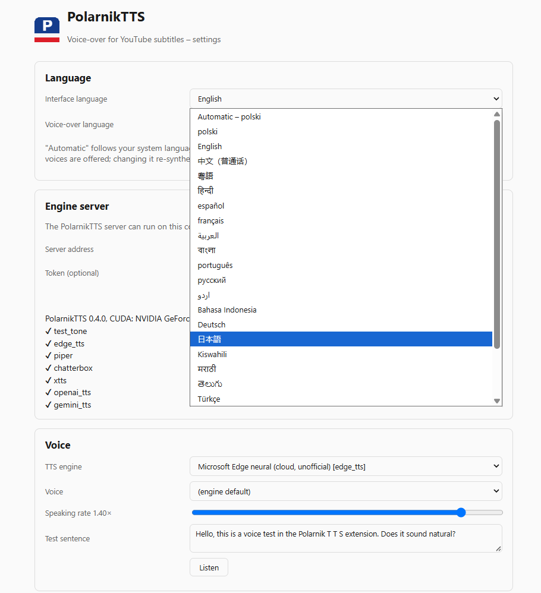
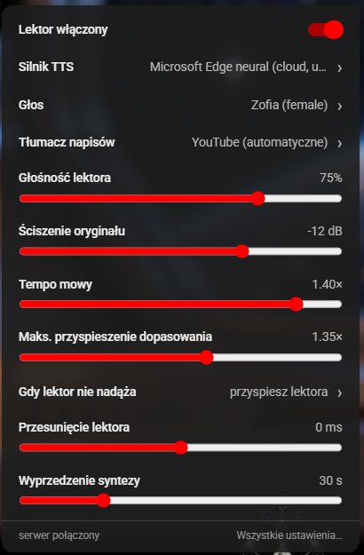
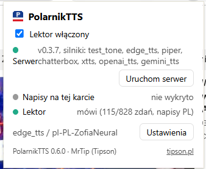
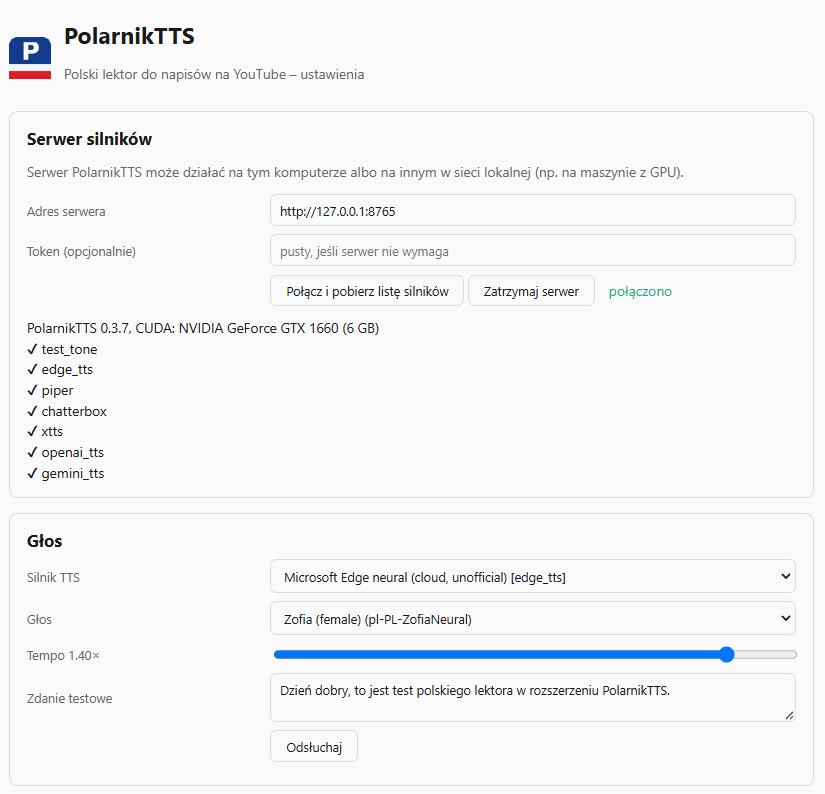
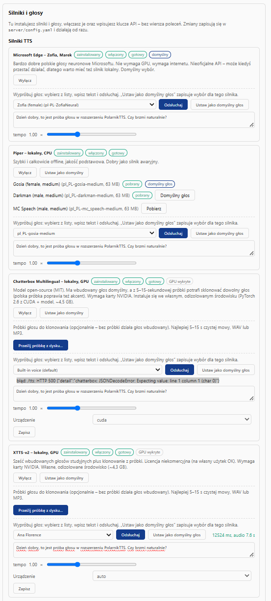
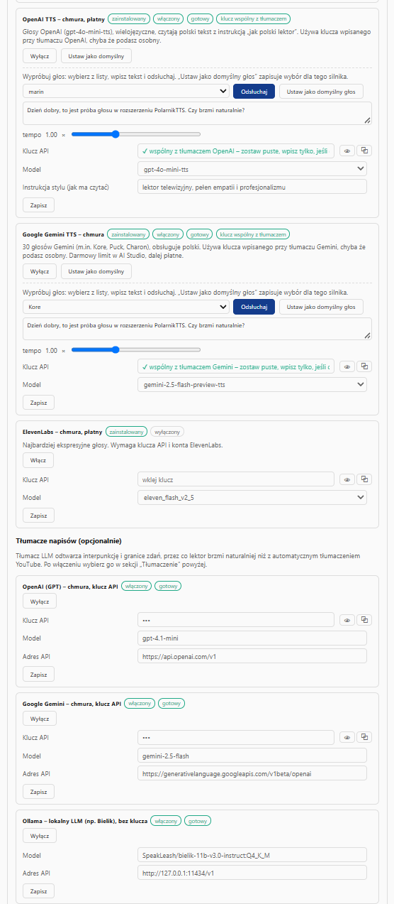
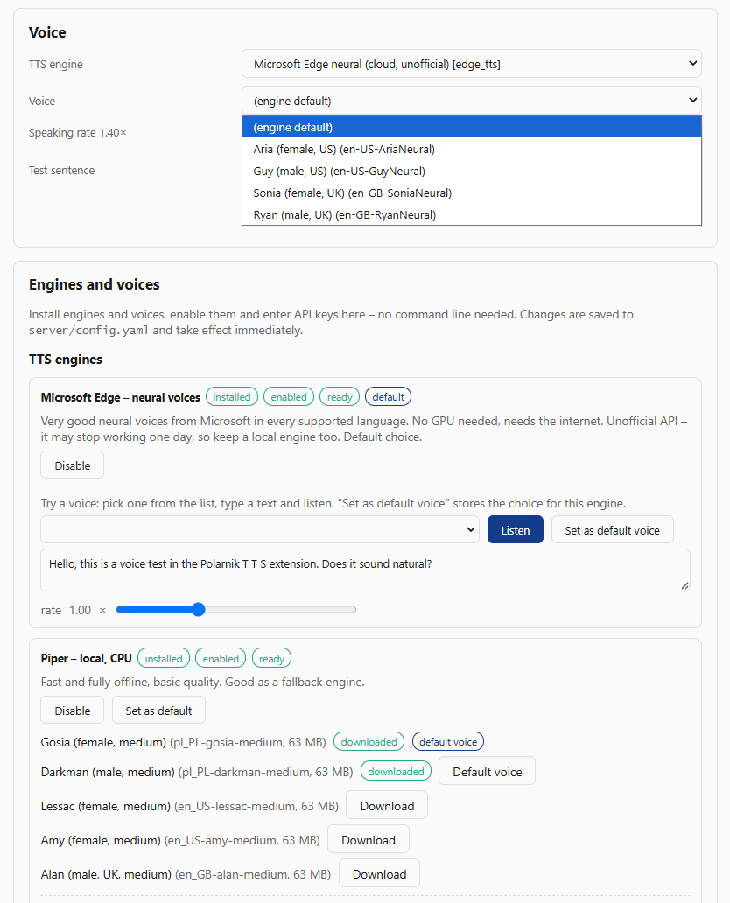
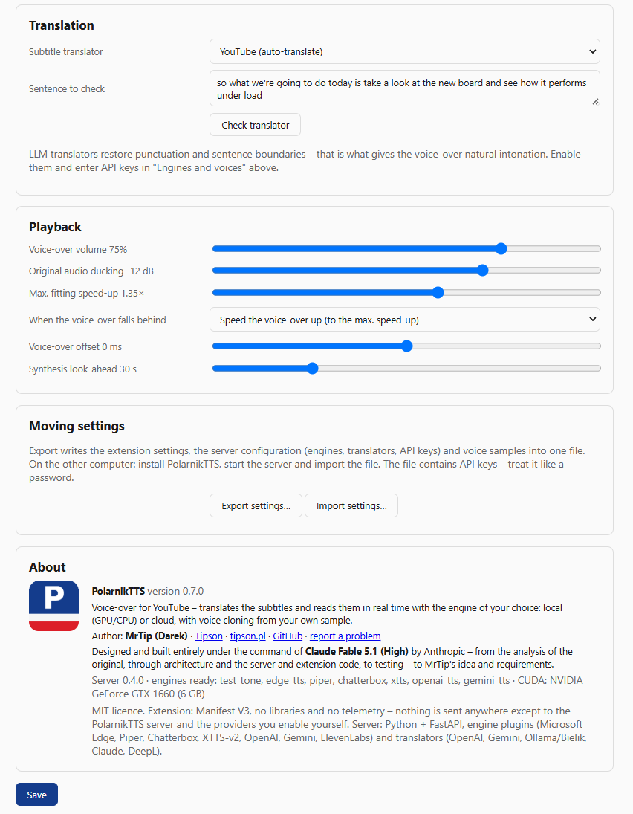
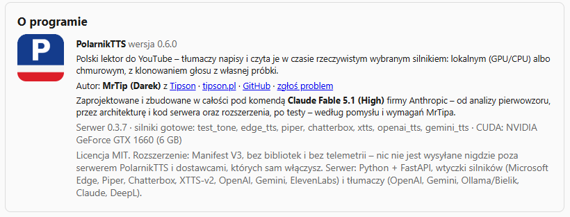

# PolarnikTTS

**Multilingual voice-over for YouTube subtitles.** A Chrome extension that translates the
subtitles of the video you are watching into *your* language and reads them with a
high-quality, selectable text-to-speech engine - local (GPU/CPU) or cloud - in sync with
the video.

🌍 **Interface in 23 languages** · 🗣️ **Voice-over in 47 languages** · 🎙️ **Voices filtered by
language** · 🇵🇱 Polish is the first-class language it was built for, everything else follows
your system language automatically or your own choice.

polski · English · 中文 · 粵語 · हिन्दी · español · français · العربية · বাংলা · português · русский ·
اردو · Bahasa Indonesia · Deutsch · 日本語 · Kiswahili · मराठी · తెలుగు · Türkçe · தமிழ் · Tiếng Việt ·
한국어 · فارسی — plus 24 more voice-over languages (čeština, magyar, українська, italiano, …).

<p align="center">
  
</p>

*The same options page in English - the interface-language picker lists every translation
in its own script; the voice-over language is a separate setting with 47 entries.*

**Status: early, working MVP.** The extension connects to the engine server, adds a "P" button
to the YouTube player bar, and when enabled it fetches the caption track, rebuilds sentences,
translates them (YouTube auto-translate or a server-side LLM/DeepL), synthesizes speech ahead
of the playhead and plays it in sync with the video while ducking the original audio.
See `docs/architecture.md` for the design and the roadmap below for what is still missing.

## Screenshots

<p align="center">
  
  &nbsp;&nbsp;
  
</p>

*Left: the settings panel inside the YouTube player (engine, voice, translator, volume,
ducking, speed, sync). Right: the toolbar popup with server, caption and voice-over status.*

<p align="center">
  
</p>

*Options page: the engine server (local or on another machine in the LAN, started and
stopped from the extension) and voice selection with a listening test.*

<p align="center">
  
  &nbsp;&nbsp;
  
</p>

*"Silniki i głosy": local engines (Microsoft Edge, Piper, Chatterbox, XTTS-v2) and cloud
engines (OpenAI, Gemini, ElevenLabs) with one-click install, voice samples for cloning, a
per-engine voice tester and API keys shared between translators and voices.*

<p align="center">
  
</p>

*Voice-over language set to English: the voice picker offers only English voices (Aria,
Guy, Sonia, Ryan) and Piper lists English voices to download next to the Polish ones already
installed. Switch the voice-over language and the lists follow.*

<p align="center">
  
</p>

<p align="center">
  
</p>

Store-ready 1280x800 versions of these captures (dark background, captions) and the 440x280
promo tile are in `docs/store/`, generated by `python scripts/make_store_screenshots.py`.

## Languages

Two independent settings, both defaulting to "automatic" (the system language):

- **Interface language** - the in-player panel, popup and options page are translated into
  Polish, English, Mandarin, Cantonese, Hindi, Spanish, French, Arabic, Bengali, Portuguese,
  Russian, Urdu, Indonesian, German, Japanese, Swahili, Marathi, Telugu, Turkish, Tamil,
  Vietnamese, Korean and Persian (`extension/locales/*.json`). A system language without a
  dictionary (say Czech or Hungarian) gets the English UI. RTL languages flip the layout.
- **Voice-over language** - what the subtitles are translated into and which voices are
  offered. All 23 UI languages plus Czech, Hungarian, Ukrainian, Italian, Dutch, Romanian,
  Greek, Swedish, Danish, Finnish, Norwegian, Slovak, Hebrew, Thai, Malay, Bulgarian,
  Croatian, Serbian, Slovenian, Lithuanian, Latvian, Estonian, Catalan and Filipino
  (`server/polarnik_server/languages.py`). A Czech user therefore gets an English UI but a
  Czech voice-over with Czech voices by default, and can pick any other language.

Voice lists are filtered by the voice-over language (Polish → Zofia and Marek, German →
Katja and Conrad, ...); engines that cannot speak the chosen language (XTTS, Chatterbox for
some languages, Piper without a voice for it) are greyed out. LLM translators get the target
language in their prompt, DeepL and YouTube auto-translate get the matching language codes,
and a caption track already in the target language is spoken as is.

## Why

Existing "speak subtitles" extensions use the browser's built-in `speechSynthesis` voice and
YouTube's auto-translate, fragment by fragment, and keep sync by speeding the voice up or
slowing the video down. PolarnikTTS instead works ahead of the playhead: it rebuilds sentences
from the caption track, translates them with context (an LLM can also restore punctuation,
which is what gives the voice its intonation), synthesizes speech ahead of time, fits it into
the subtitle time slot and plays it on a Web Audio clock while ducking the original audio.

## Components

| Directory | What it is |
|---|---|
| `server/` | Python engine server (FastAPI). Pluggable TTS engines and translation providers, on-disk audio cache. Runs on the same PC or on another machine in your LAN (e.g. the one with the GPU). |
| `extension/` | Chrome extension (Manifest V3, plain ES modules, no build step). Load it unpacked from this folder. |
| `bench/` | Listening bench: renders the same Polish sentences with every configured engine and produces an HTML page to compare them side by side. |
| `host/` | Native messaging host manifest template and the fixed extension id. |
| `docs/` | Architecture and design notes. |

### TTS engines (server plugins)

| Engine id | Where it runs | Polish quality | Notes |
|---|---|---|---|
| `edge_tts` | cloud (free, unofficial) | very good prosody | Microsoft neural voices `pl-PL-ZofiaNeural`, `pl-PL-MarekNeural`; unofficial API, may break |
| `chatterbox` | local GPU (~4 GB VRAM) | good, voice cloning | Resemble AI Chatterbox Multilingual, MIT; some setups report an English accent in Polish - a Polish reference clip helps |
| `xtts` | local GPU | decent, voice cloning | Coqui XTTS-v2, non-commercial model licence |
| `piper` | local CPU | basic | very fast, robotic; always-works fallback |
| `openai_tts` | cloud (paid) | good, multilingual voices | `gpt-4o-mini-tts` with a "Polish narrator" instruction; reuses the OpenAI translator key |
| `gemini_tts` | cloud (free tier / paid) | good | Gemini TTS (30 voices, Polish supported); reuses the Gemini translator key |
| `elevenlabs` | cloud (paid) | best expressiveness | Flash v2.5 / v3 via REST |
| `test_tone` | anywhere | n/a | synthetic beep for pipeline tests |

### Translation providers (server plugins)

`openai_compat` (OpenAI, Gemini in OpenAI mode, Ollama with e.g. Bielik, OpenRouter, LM Studio),
`anthropic`, `deepl`, and `youtube` (YouTube's own auto-translate, handled inside the extension).
LLM providers restore punctuation and sentence boundaries; DeepL and YouTube do not.

## Installation

Requirements: Python 3.10+, Chrome 116+. For local GPU engines: an NVIDIA GPU with a recent driver.

### Windows

```powershell
git clone https://github.com/<you>/PolarnikTTS.git
cd PolarnikTTS
.\install.cmd                                   # edge-tts + piper, no GPU needed
.\run_server.cmd
```

GPU engines (Chatterbox, XTTS) are installed later - from the extension's options page or with
`server\.venv\Scripts\python scripts\install_engine.py chatterbox`. Each gets its own
virtualenv under `server\envs\<engine>\` with the torch build it pins (Chatterbox needs
`torch==2.6.0`, installed from the CUDA 12.6 index when an NVIDIA driver is present) and runs
as a worker process, so its pins never touch the server's environment or the other engine.
On Blackwell GPUs (GeForce RTX 50xx, compute capability 12.x) the installer overrides
Chatterbox's `torch==2.6.0` pin with `torch 2.7.1+cu128`, the oldest build that ships kernels
for those cards; `torch 2.6/cu126` fails there with *"CUDA error: no kernel image is available
for execution on the device"*. If an engine was installed before that logic existed, its card
on the options page shows the mismatch and a "Przeinstaluj" button that fixes it in place.
`.\reinstall_server_env.cmd` wipes `server\.venv` and reinstalls it if it ever gets into a
broken state.

The `.cmd` wrappers run the `.ps1` scripts with `-ExecutionPolicy Bypass`, so they work on a
stock Windows install where running PowerShell scripts is disabled. If you have already enabled
scripts (`Set-ExecutionPolicy -Scope CurrentUser RemoteSigned`), `.\install.ps1` works too.

The extension can also start the server itself: when the server is down, the in-player panel
and the toolbar popup show an **Uruchom serwer** button. This works through a Chrome native
messaging host (`server/polarnik_host.py`) that `install.cmd` registers for the current user
(`install_host.cmd` re-registers it on its own; `-Uninstall` removes it). The extension has a
fixed id (`host/EXTENSION_ID`, set by the `key` in `manifest.json`), so the registration is the
same on every machine.

To have the server start with Windows in the background (no console window), run
`.\autostart.cmd` once; it adds a shortcut to your Startup folder and starts the server
immediately. `.\autostart.cmd -Uninstall` removes it, `.\stop_server.cmd` stops a background
server. Logs are written to `server\logs\server.log`. A second instance on the same port exits
quietly, so autostart and a manual `run_server.cmd` do not fight each other.

### Linux / macOS

```bash
./install.sh                                    # edge-tts + piper
EXTRAS=edge,piper,chatterbox CUDA=cu128 ./install.sh
./run_server.sh
```

The installer creates `server/.venv`, copies `server/config.example.yaml` to
`server/config.yaml` and downloads the Piper Polish voices. Edit `config.yaml` to enable
engines, set API keys, or expose the server on your LAN (`host: 0.0.0.0` + a `token`).

### Chrome extension

1. Open `chrome://extensions`, enable **Developer mode**.
2. **Load unpacked** and pick the `extension/` folder.
3. The options page opens: enter the server address (default `http://127.0.0.1:8765`),
   click **Połącz** (or **Uruchom serwer** if it is not running), choose an engine and a voice,
   press **Odsłuchaj**, then **Zapisz**. Out of the box the default is Microsoft Edge
   `pl-PL-ZofiaNeural`, which needs no GPU and no key.

### Managing engines from the options page

The **Silniki i głosy** section of the options page talks to the server's management API
(`/manage/*`, accepted only from the local machine or with the bearer token). From there you
can install an engine (light ones into the server's venv, GPU ones into their isolated venv
with a CUDA build of PyTorch when an NVIDIA driver is present), download Piper voices or the
Chatterbox/XTTS models, enable/disable engines and translators, enter API keys, pick the
default engine and voice, upload voice samples for the cloning engines (stored as mono WAV in
`server/voices/`, each one becomes a selectable voice; without a sample Chatterbox uses its
built-in voice and XTTS its studio speakers), and stop the server. Long operations run as background jobs with a
live log. Changes are written to `server/config.yaml`; after installing packages into its own
environment the server restarts itself, everything else applies immediately.

## Listening bench

```bash
# with the server virtualenv active (server/.venv)
python bench/bench.py                       # all ready engines from server/config.yaml
python bench/bench.py --engines edge_tts,piper --limit 5
```

Open `bench/out/index.html` to compare the engines sentence by sentence, with synthesis time,
audio duration and real-time factor.

## Server API

| Endpoint | Description |
|---|---|
| `GET /health` | version, CUDA info, ready engines/translators |
| `GET /engines` | engine list with readiness, reason, voices |
| `GET /translators` | translation providers |
| `POST /tts` `{text, engine?, voice?, speed?}` | audio (`audio/wav` or `audio/mpeg`), headers `X-Duration`, `X-Cache` |
| `POST /translate` `{sentences, source_lang?, context_before?, context_after?, translator?}` | `{translations: [...]}` |
| `GET /manage/catalog`, `POST /manage/install`, `GET /manage/jobs/{id}`, `POST /manage/config`, `POST /manage/reload`, `POST /manage/shutdown` | management (local-only unless a token is set) |

If `server.token` is set, every request except `/health` needs `Authorization: Bearer <token>`.

## Roadmap

1. Engine server, bench, extension skeleton - done
2. Sentence reconstruction from `json3` captions, translation pipeline with context - done
3. Look-ahead synthesis, scheduled playback, ducking, seek/pause handling, player-bar button - done (MVP)
4. Duration fitting beyond 1.35x (LLM condensing), voice cloning UI, per-video pre-render, cache management
5. Live streams (true streaming path)

### Using it on YouTube

Start the server, open a video with captions (any language but Polish), and click the **P**
button in the player bar (next to the subtitles/settings buttons). The dot on the button shows
the state: grey = off, yellow = loading captions, green = speaking, blue = nothing to do
(no captions, or captions already Polish), red = error (hover for the message). The toolbar
popup shows the same status with sentence progress.

## Author and credits

PolarnikTTS is made by **MrTip (Darek)** of [Tipson](https://tipson.pl). The whole project -
analysis of the original extension, architecture, server and extension code, tests - was
designed and built under the command of **Claude Fable 5.1 (High)** by Anthropic, to MrTip's
idea and requirements.

## Publishing

- **GitHub**: the repository is ready as is (`.gitignore` keeps `config.yaml`, models, envs,
  voice samples, logs and the generated host files out). `git init && git add . && git commit
  -m "PolarnikTTS" && git remote add origin https://github.com/mrtipeq/PolarnikTTS.git && git push -u origin main`.
- **Chrome Web Store**: `pack_extension.cmd` (or `python scripts/pack_extension.py`) builds
  `dist/PolarnikTTS-<version>-store.zip` (manifest without the `key` field, as the store
  requires) and, when given the private key, `dist/PolarnikTTS-<version>-store-with-key.zip`
  which includes `key.pem` so that the store keeps the same extension id as the unpacked
  version (needed for the native messaging host). See `docs/chrome-web-store.md` for the
  listing text, permission justifications and the privacy policy (`docs/privacy-policy.md`).

## Licence

MIT. Third-party models and services keep their own licences (see the engine table above).
